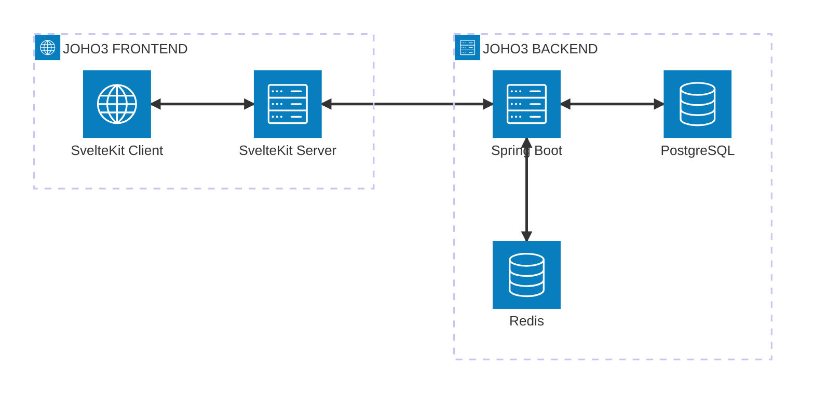
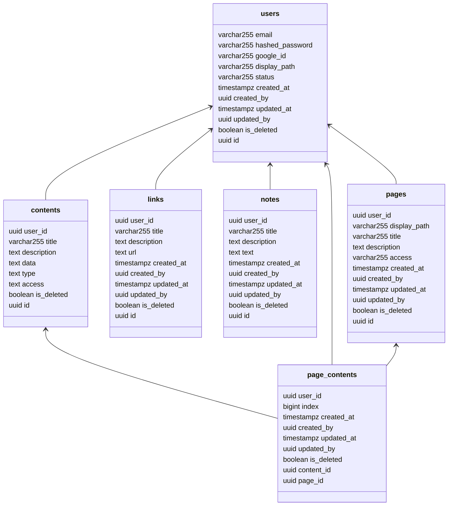

# J3BE - JOHO3 BACKEND

> **JOHO3** is a web application for **simple** personal workspaces with texts and links.
>
> Reference: [`JOHO3 FRONTEND`](https://github.com/yozakura-minato/j3fe) [`Ticket Board`](https://github.com/users/yozakura-minato/projects/5/views/7)

## Core Techniques


- [`Spring Boot`](https://docs.spring.io/spring-boot/index.html) in [`Java`](https://dev.java/learn)
- [`PostgreSQL`](https://neon.com/postgresql/tutorial) for database, [`Redis`](https://www.tutorialspoint.com/redis/index.htm) for caching
- Check [`References`](#references) for more details

## Dev Tools


- [`IntelliJ IDEA`](https://www.jetbrains.com/idea/download) (community edition) for IDE
- [`Gradle`](https://docs.gradle.org) for dependency management
- [`Docker`](https://docs.docker.com/get-started) in [`Docker Desktop`](https://docs.docker.com/desktop/setup/install/windows-install) for infra & DevOps
- Check [`References`](#references) for more details

## System Architecture Diagram



## Database Schemas



## Getting Started

1. Clone this project into your device.
2. Open your project with `IntelliJ IDEA`.
3. Download dependencies with **Gradle** in [`build.gradle`](build.gradle).
4. In `Run/Debug Configurations` dialog, set `Add VM Options` as:

```
-Duser.timezone=Asia/Ho_Chi_Minh
```

and `Active Profiles` as:

```
dev
```

5. Create **compose.yaml** file (see [`compose.example.yaml`](compose.example.yaml) for reference)
6. Create **application-dev.yaml** file (see [
   `application-dev.example.yaml`](./src/main/resources/application-dev.example.yaml) for reference)
7. Start **Docker Deamon** by running `Docker Destop`.
8. Run your local **J3BE**.
9. Your local **J3FE** is now running at http://localhost:8080.
```
||=======================================||
|| J3BE APPLICATION STARTED SUCCESSFULLY ||
||=======================================||
|| Running Mode: Development             ||
|| API Base URL: http://localhost:8080   ||
||=======================================||
```

---

# REFERENCES

## Dependencies

- [`Docker Compose Support`](https://docs.spring.io/spring-boot/4.1.0/reference/features/dev-services.html#features.dev-services.docker-compose)
- [`Spring Modulith`](https://docs.spring.io/spring-modulith/reference/)
- [`Spring Web`](https://docs.spring.io/spring-boot/4.1.0/reference/web/servlet.html)
- [`Spring HATEOAS`](https://docs.spring.io/spring-boot/4.1.0/reference/web/spring-hateoas.html)
- [`Spring Security`](https://docs.spring.io/spring-boot/4.1.0/reference/web/spring-security.html)
- [`OAuth2 Resource Server`](https://docs.spring.io/spring-boot/4.1.0/reference/web/spring-security.html#web.security.oauth2.server)
- [`Spring Data JPA`](https://docs.spring.io/spring-boot/4.1.0/reference/data/sql.html#data.sql.jpa-and-spring-data)
- [`Flyway Migration`](https://docs.spring.io/spring-boot/4.1.0/how-to/data-initialization.html#howto.data-initialization.migration-tool.flyway)
- [`Spring Data Redis (Access+Driver)`](https://docs.spring.io/spring-boot/4.1.0/reference/data/nosql.html#data.nosql.redis)
- [`MapStruct`](https://mapstruct.org/documentation/stable/reference/html)

## Guides

- [Gradle Plugin](https://docs.spring.io/spring-boot/4.1.0/gradle-plugin)
- [Create an OCI image](https://docs.spring.io/spring-boot/4.1.0/gradle-plugin/packaging-oci-image.html)
- [Gradle Build Scans – insights for your project's build](https://scans.gradle.com#gradle)
- [Building a RESTful Web Service](https://spring.io/guides/gs/rest-service/)
- [Serving Web Content with Spring MVC](https://spring.io/guides/gs/serving-web-content/)
- [Building REST services with Spring](https://spring.io/guides/tutorials/rest/)
- [Building a Hypermedia-Driven RESTful Web Service](https://spring.io/guides/gs/rest-hateoas/)
- [Securing a Web Application](https://spring.io/guides/gs/securing-web/)
- [Spring Boot and OAuth2](https://spring.io/guides/tutorials/spring-boot-oauth2/)
- [Authenticating a User with LDAP](https://spring.io/guides/gs/authenticating-ldap/)
- [Accessing Data with JPA](https://spring.io/guides/gs/accessing-data-jpa/)
- [Messaging with Redis](https://spring.io/guides/gs/messaging-redis/)
- [Defining a mapper with MapStruct](https://mapstruct.org/documentation/stable/reference/html/#defining-mapper)